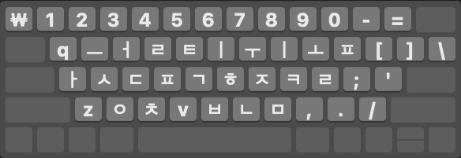

# HNC Romaja for Korean

# Schema

## Schema Name
`hnc_romaja`

## Single-Key Jamos
| Jamo | Key | Alternative Keys |
|-----|------|-----------------|
|  ㅡ  |  w  ||
|  ㅓ  |  e  ||
|  ㄹ  |  l | r |
|  ㅌ  |  t  |
|  ㅣ  |  i | y |
|  ㅜ  |  u  |
|  ㅗ  |  o  |
|  ㅍ  |  p | f |
|  ㅏ  |  a  |
|  ㅅ  |  s  |
|  ㄷ  |  d  |
|  ㄱ  |  g  |
|  ㅎ  |  h  |
|  ㅈ  |  j  |
|  ㅋ  |  k  |
|  ㅇ  |  x  | ng* |
|  ㅊ  |  c  |
|  ㅂ  |  b  |
|  ㄴ  |  n  |
|  ㅁ  |  m  |

(*) Note: ng can only be used in two situations:
1. To type a single syllable ㅇ (U+3147, Hangul letter ieung) or ㆁ (U+3181, Hangul letter Yesieung, merged with ㅇ in modern Korean).
2. At the end of a syllable. For example, you can type "bang" or "bax" to get 방. However, you can only type "xa" to get 아 while typing "nga" gives you "ㄴ가".

## Double Consonants
| Jamo | Keys | Alternative Keys |
|-----|-----|-----------------|
|  ㄲ  |  G  | gg* |
|  ㅆ  |  S  | ss* |
|  ㄸ  |  D  | dd |
|  ㅉ  |  J  | jj |
|  ㅃ  |  B  | bb |

(*) Note: `gg` and `ss` do not produce `ㄲ` and `ㅆ` at syllable final position. Instead, they produce two separate `ㄱㄱ` and `ㅅㅅ` respectively. See the Rationale for Change section of the modified HNC Romaja below for an explanation.

## Multi-Key Jamos

| Jamo | Keys|
|-----|-----|
|  ㅐ  |  ai |
|  ㅑ  |  ia |
|  ㅒ  |  iai |
|  ㅔ  |  ei |
|  ㅕ  |  ie |
|  ㅖ  |  iei |
|  ㅘ  |  oa |
|  ㅙ  |  oai |
|  ㅚ  |  oi |
|  ㅛ  |  io |
|  ㆇ  |  ioia |
|  ㆈ  |  ioiai |
|  ㆉ  |  ioi |
|  ㅝ  |  ue |
|  ㅞ  |  uei |
|  ㅟ  |  ui |
|  ㅠ  |  iu |
|  ㆊ  |  iuie |
|  ㆋ  |  iuiei |
|  ㆌ  |  iui |
|  ㅢ  |  wi |

# Credits
This schema is a fork of https://github.com/rime-aca/rime-hangyl.
